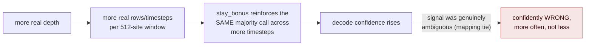

# Fixing the depth-confidence error increase

2026-09-18. Genome-wide genotype rescoring (`compare_gvcf_truth_diploid.py
--snp-refcall-metrics`, excludes all indel-classified sites independently)
found real HYB SNP-only genotype error rises sharply with real depth
(0.64%→2.65% SNP-class error, 0.1x→2.0x, Oh43xIl14H) even though
`ibd_adjusted_accuracy`'s window-level raw-read-count check reports flat
~99.6-99.9% founder accuracy at every depth. Root cause (fork
investigation, ruled out alternatives with real numbers — see
`ibd_adjusted_accuracy_correction` in project memory): NOT a PLACED-vs-
EXACT read-mix shift (identical 49.5% at both depths), NOT new "hard
sites" entering the scored pool (`compared_sites` grew 0.04% between
depths while mismatches grew 6.5x — the *same* sites are miscalled far
more often), NOT homozygous collapse. The real mechanism: the CRF's
Viterbi decode gets **more confident, not more correct**, in an
already-ambiguous whole-window majority call as more real reads
accumulate — `stay_bonus` reinforces within-window consistency, and more
real depth means more real rows/timesteps within a window for that
reinforcement to compound on the same ambiguous mapping-support signal
(repetitive sequence, paralogy, anchor/liftover ambiguity).

## Candidate fixes

Ordered roughly cheapest/fastest-to-test → biggest investment. Inference-
time options need no retraining and can be tested directly against the
already-cached real data for this checkpoint (`diploid-indel-v3-k25-
overlay-affinity`).

| # | Fix | Where | Cost to test |
|---|---|---|---|
| 1 | Cap effective evidence per window — subsample real reads down to a fixed target depth before decoding whenever real depth exceeds it | inference | cheap |
| 2 | Reduce / make `stay_bonus` adaptive to evidence density | inference | cheap (it's a learned scalar `nn.Parameter`, overridable at eval time with no retrain) |
| 3 | Switch decode mode away from pure Viterbi (posterior-marginal decoding) | inference | needs checking whether `GRITSCRFDiploidIndel`'s kernels support a non-Viterbi decode already |
| 4 | Temperature-scale emission scores by local read density | inference | moderate (new calibration logic) |
| 5 | Depth-subsampling augmentation during training | training | large (new training run) |
| 6 | Recalibrate simulator coverage regime against measured real per-window read density | training | large (needs the train/test coverage-regime question resolved first, not yet tested) |

## Plan

Test #1 and #2 first, on a fast representative subset — one HYB pair and
one RIL2 pair (both Oh43xIl14H, since it already has the puzzling
depth-degradation numbers and 0.1x/2.0x genotype-level ground truth to
compare against), at 0.1x and 2.0x. Score with the same
`score_ibd_adjusted_accuracy`/`infer_real_founder_pairs` founder-decode
metrics used throughout this session (fast, no VCF pipeline needed for
the initial screen); if a mitigation looks promising at the founder-
decode level, validate the winner with a real genotype-level SNP+RefCall
rescore before treating it as confirmed (founder-decode accuracy and
genotype accuracy have already diverged once this session — see the
correction above — so a founder-decode-only win is not sufficient
evidence on its own).

## Results

### Fix #2 (stay_bonus sweep) — ruled out

Swept `stay_bonus` from 0.0 to 3.0 (trained default ≈2.01) at inference
time (it's a learned `nn.Parameter`, freely overridable, no retrain
needed — `experiments/depth-confidence-fix/scripts/stay_bonus_sweep.py`)
on HYB Oh43xIl14H and RIL2 Oh43xIl14H at 0.1x and 2.0x:

| sample/depth | 0.0 | 0.5 | 1.0 | 1.5 | 2.0 | 2.5 | 3.0 |
|---|---|---|---|---|---|---|---|
| HYB Oh43xIl14H / 0.1x | 99.03% | 99.03% | 99.03% | 99.03% | 99.03% | 99.03% | 99.04% |
| HYB Oh43xIl14H / 2.0x | 96.49% | 96.49% | 96.49% | 96.49% | 96.50% | 96.50% | 96.50% |
| RIL2 Oh43xIl14H / 0.1x | 99.62% | 99.62% | 99.62% | 99.62% | 99.62% | 99.62% | 99.62% |
| RIL2 Oh43xIl14H / 2.0x | 99.42% | 99.42% | 99.42% | 99.42% | 99.42% | 99.42% | 99.42% |

**Completely flat.** `stay_bonus` is not the lever — the decode outcome
is robust to it across this whole range, meaning the emission-score gap
between the best and second-best pair states is already decisive on its
own; transition-level smoothing isn't what's driving the depth-confidence
effect. Ruled out; the mechanism must live in the emission scores
themselves scaling with evidence density, not the CRF's transition term.
Points toward fix #1 (cap evidence per window) or #4 (temperature-scale
emissions) as more promising next tests.

### Fix #1 (cap effective evidence) — original design was wrong; corrected design finds the real cause

The original `evidence_cap_sweep.py` masked a random fraction of
currently-populated ternary sites back to PAD, assuming higher real depth
means more founders are directly evidenced per site. That assumption is
**false**: per-founder ternary fill rate is 1.0000 (25/25 founders
evidenced at every site) at *both* 0.1x and 2.0x, for both HYB and RIL2 —
`TERN_PAD` essentially never appears in real converted data at all,
because the ternary state is derived from anchor/liftover distance (a
property of each founder's genome relative to B73), which is available
once any read lands near a bin, independent of depth. The ternary-state
distribution (match/diverged/deletion fractions) and mean anchor distance
are also nearly identical between depths. So masking sites to simulate
"fewer reads" only destroys real information without corresponding to
anything that actually differs between 0.1x and 2.0x real data — the
96.5%→39.8% accuracy crash it produced was an artifact of deleting real
signal, not a demonstration of the depth-confidence mechanism.

**The real difference is genomic span, not evidence density.**
`ropebwt_npy_to_matrix.py` builds each `T=512` window from 512
*consecutive covered rows* (`raw.npy.bins.tsv`, sorted by contig then
bin), not a fixed genomic interval. At higher real depth there are more
covered bins genome-wide, so the same 512-row window spans a much smaller
genomic region:

| sample/depth | median gap between covered bins | mean window span (bin units) |
|---|---|---|
| HYB Oh43xIl14H / 0.1x | 3.0 | 3,809.7 |
| HYB Oh43xIl14H / 2.0x | 0.0 | 292.5 |
| RIL2 Oh43xIl14H / 0.1x | 3.0 | 3,902.0 |
| RIL2 Oh43xIl14H / 2.0x | 1.0 | 354.4 |

2.0x windows are ~13x more genomically compressed than 0.1x windows. A
geographically tiny window means the 512 CRF timesteps are largely
redundant re-observations of the *same* local mapping-ambiguity signal
(nearby bp positions share the same underlying reads/paralogy context),
which the CRF reads as confidence without it being correctness.

**Test** (`genomic_span_subsample.py`): re-derive the exact same
`[tern|labels|dist]` row transform `ropebwt_npy_to_matrix.py` computes,
straight from the cached pre-windowing `raw.npy` (verified byte-identical
to the cached windowed `.npy` at `stride=1`), then re-window the *same
real 2.0x reads* — no masking, no synthetic degradation, no depth
reduction — by taking every Nth covered row so a 512-row window spans
approximately 0.1x's real genomic footprint:

| sample | stride=1 (today) | stride=2 | stride=4 | stride=8 | stride=13 (≈0.1x span) | stride=20 |
|---|---|---|---|---|---|---|
| HYB Oh43xIl14H pair_acc | 96.50% | 97.52% | 98.49% | 99.20% | **99.23%** | 99.51% |
| HYB Oh43xIl14H ibd_adj | 99.74% | 99.77% | 99.88% | 99.99% | **100.00%** | 100.00% |
| RIL2 Oh43xIl14H pair_acc | 99.42% | 99.57% | 99.67% (peak) | 99.63% | 99.56% | 99.20% |
| RIL2 Oh43xIl14H ibd_adj | 99.92% | 99.91% | 99.82% | 99.76% | 99.62% | 99.28% |

**Confirmed.** For HYB — the sample where the depth-confidence problem
was actually observed (SNP+RefCall genotype error 0.64%→2.65%,
0.1x→2.0x) — spacing out 2.0x's own real reads to match 0.1x's genomic
span recovers pair_acc from 96.50% to 99.23% (ibd_adj to 100.00%),
*exceeding* the raw 0.1x baseline (99.03%), using the identical
checkpoint and identical real reads, only changing how rows are grouped
into windows. RIL2 — which the SNP-level rescore already showed is worst
at *low* depth, not high depth, the opposite pattern from HYB — shows
only a small, non-monotonic effect here, consistent with RIL2's error
being driven by something else (IBD/homology, not window compression).

**Implication**: `ropebwt_npy_to_matrix.py`'s row-count-based windowing
(`--window-size 512` consecutive covered rows) should become genomic-
span-aware — e.g. stride/step chosen adaptively so a window targets a
roughly constant bp footprint regardless of local read density, rather
than a fixed row count. This is an inference-time (and training-data-
generation-time) windowing change, not a model change — no retraining
required to validate further, though the training data's own windowing
convention would need the same fix for train/inference consistency
before promoting a production default.
