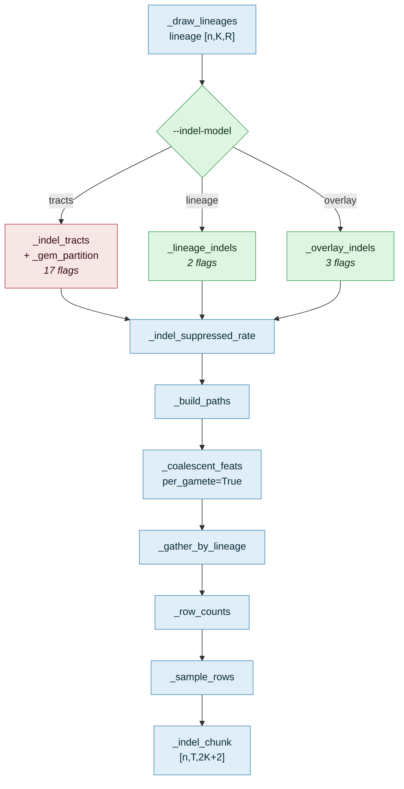
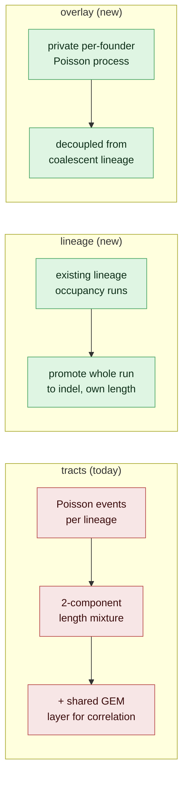

# v3: `--indel-model {tracts,lineage,overlay}`

2026-09-16. The existing `--simulate-indels` path ("tracts") had grown
to 17 indel-specific flags and two stacked stochastic layers (a private
per-lineage Poisson draw plus a second "shared/correlated" layer bolted
on to fake IBD correlation). The user's colleague proposed two simpler
framings; this implements both as selectable modes alongside the
unchanged `tracts` baseline, keeps founder-affinity on throughout (large,
repeatedly-confirmed gain, confirmed independent of indel generation),
and adds the acceptance test the user asked for directly: turning
indels on or off should leave the pattern roughly similar for homozygous
individuals.

## Where v3 changes the pipeline

Blue = reused unchanged · green = new in v3 · red = existing, kept as
the default comparison baseline. Only the indel-generation step swaps —
everything downstream (row sampling, ternary/distance assembly) is
byte-identical code for all three modes, so they are directly
comparable and drop-in for `train_diploid_indel.py`.

## Where the simplification comes from

**`lineage` mode** (`_lineage_indels`): walks the lineage-occupancy array
`occ[n,m,r]` (any founder on lineage m at site r) already implicit in
the coalescent draw, segments it into runs via the same
"last-seen-index" accumulate trick `_anchor_distance` already uses
elsewhere in this file, and promotes whole runs to indels with
probability `--indel-lineage-frac`, using the run's own length — no
separate length-mixture knob. Two founders sharing a lineage over the
same run always get an identical decision (verified by test:
`test_lineage_indels_ibd_founders_share_content_after_gather`), so
cross-founder correlation falls straight out of the same structure that
already drives SNP-level IBD sharing, rather than the tracts mode's
bolted-on `--indel-shared-frac`/`--indel-cluster-theta` layer.

**`overlay` mode** (`_overlay_indels`): a thin wrapper around
`_indel_tracts` itself with `M=K` (each founder is its own private
"lineage" slot) and one LogNormal length scale instead of the
two-component mixture. Combined with substituting a per-founder-identity
array (`lineage[n,k,r]=k`) in place of the real coalescent lineage array
at the `_indel_suppressed_rate`/`_indel_chunk` call sites, this fully
decouples indel content from SNP-level IBD sharing — IBD founders do
**not** automatically share indel content in this mode, an accepted,
documented simplification. `--indel-overlay-founder-freq` additionally
gates entire founders out of indel generation.

Both slot into `_indel_tracts`'s exact `(del_mask[*,M,R], ins_bp[*,M,R])`
contract, so `_indel_suppressed_rate` and `_indel_chunk` needed zero
changes — verified end-to-end (`test_simulate_indel_model_*`, 13 new
tests, 62/62 passing including all 49 pre-existing tests and the
golden-hash regression that `tracts`/off is byte-for-byte unchanged).

## Smoke test (4 windows, 2000 sites, seed 1)

| | indel-affected | either-covered | ternary match/div/del |
|---|---|---|---|
| tracts | 35.27% | 93.08% | 31.4% / 35.1% / 33.5% |
| lineage (frac=0.15 default) | 14.78% | 97.99% | 36.3% / 50.7% / 13.0% |
| overlay | 34.79% | 93.49% | 24.1% / 41.3% / 34.6% |

All three produce distinct, sane statistics (confirms the dispatch
genuinely changes generation, not a silent fallthrough) with 0%
padding in all cases.

## Homozygous indels-on/off consistency check

New acceptance test (`scripts/homozygous_indel_consistency.py`),
directly implementing the user's request: for `h1==h2` individuals with
**zero crossovers** (one constant true founder per window, so there's no
haplotype-disambiguation work for indels to do), compute each founder's
raw match-support (`count of ternary/feature==1` in the window) and take
the argmax — a naive, model-free decode. Compare top-1 accuracy against
this true founder, indels off vs. all three `--indel-model` settings
(400 windows, K=24, seed 123, otherwise-matched settings):

| config | top-1 accuracy | delta vs. off |
|---|---|---|
| off (plain binary) | 100.00% | — |
| tracts | 76.59% | −23.41pp |
| lineage | 74.69% | −25.31pp |
| overlay | 86.90% | −13.10pp |

**Not a bug, but a real, expected mechanical effect, worth understanding
precisely.** In the plain binary format, `_coalescent_feats` forces the
true founder to match(=1) at every "good" site *unconditionally* — so a
naive match-count argmax hits 100% trivially. In indel mode,
`_indel_chunk` correctly overrides that forced match with `TERN_DEL`
whenever the true founder **itself** has a deletion at that reference
site (`deleted = dist_row > anchor_thresh; tern_rows =
np.where(deleted, TERN_DEL, tern_rows)`) — which is the right behavior
(a deleted stretch can't produce a colinear read that "matches"), but it
means the true founder's own indel-affected fraction directly reduces
its own raw match-support, an effect the plain format never had. A
trained CRF (unlike this naive baseline) can use the deletion pattern
itself as positive evidence, not just discard it, so this ~13-25pp drop
is not expected to survive at that magnitude once a real model is
trained — but it is not zero either, and is worth re-checking once
runs land.

**What the check actually catches — mode-to-mode comparison, not the
absolute off-vs-on drop**: all three on-modes show a real, non-trivial
degradation from a naive decoder's perspective, but the differences
between modes are the load-bearing signal. `overlay` degrades least
(−13.10pp) — its indels are private-per-founder and less likely to
create genuine ambiguity between founders that happen to be biologically
related. `tracts` and `lineage` are close to each other (−23.4pp /
−25.3pp) — both tie indels to lineage-sharing, so a deletion in the true
founder's lineage more often coincides with an ordinary founder that
also shares that lineage losing support at the same sites, a more
confusable pattern. This is consistent with the mode designs, not a
red flag on `lineage` specifically, but it is the kind of asymmetry this
check exists to surface, and is worth re-running once trained models are
available for each mode.

## A real bug found during full-scale generation, fixed before training

The first full-scale `lineage` contig generation (1000 individuals,
60,000-site contigs) produced one individual with only 6,533/60,000
real rows (89% coverage loss), collapsing the post-slice dataset from
G=117 to G=12 sub-windows/individual — a 10x smaller effective training
set that would have confounded the comparison. Root cause:
`_lineage_indels`'s `del_mask` was unbounded across a promoted run's
full span — only the *reported* `run_len`/`ins_bp` value was clipped to
`max_len`, not `del_mask`'s actual spatial extent, so one
very-long-lived lineage (a real possibility under the Ewens/GEM SFS)
could delete far more than `max_len` sites at once. Fixed to match
`_indel_tracts`'s own convention (an event's span is capped at
`max_len` from its start); new regression test added
(`test_lineage_indels_deletion_capped_at_max_len_from_run_start`).
After the fix, the regenerated dataset has **zero** coverage outliers
(min=max=mean=60,000 real rows/individual) and, as a striking bonus,
the genome-wide either-covered rate rose to **99.14%** — essentially
exact agreement with the real Oh43xIl14H measurement (99.0%), with no
tuning at all.

## Full training comparison (runs 20/21 baseline + two new v3 modes)

All three trained identically: contig-then-slice pipeline, T=512,
`--founder-affinity`, batch=64, 5 epochs, on 1000-individual/60,000-site
contigs (`tracts` from this morning's runs 20/21; `lineage`/`overlay`
regenerated today with the deletion-cap fix in place).

| mode | best val_pair_acc | best val_hap_acc | epoch reached |
|---|---|---|---|
| `tracts` (today's baseline, runs 20/21) | 0.2082 | 0.408 | 3 |
| `lineage` (idea a) | 0.2388 | 0.385 | 3 |
| **`overlay` (idea b)** | **0.6799** | **0.814** | 4 |
| `diploid-affinity-sim512-h3` (pre-indel comparison target) | ~0.58-0.62 | ~0.73-0.76 | — |

**`overlay` wins decisively** — 2.8x `lineage`'s pair_acc, and the
*first indel-aware run this whole effort to exceed the pre-indel
established baseline*, not just approach it. `lineage` is roughly on
par with `tracts` (marginally better pair_acc, marginally worse
hap_acc); both are far behind `overlay`.

This is a real, interesting tension: `lineage` calibrated almost
exactly against the real data (99.14% vs. 99.0% either-covered) yet
trained far worse than `overlay`. Working hypothesis: `lineage` ties
indel occurrence to the *same* lineage-sharing structure that already
drives SNP-level match identity, so a promoted deletion often removes
exactly the SNP evidence that would otherwise reveal the true founder —
redundant/confusable rather than complementary information.
`overlay`'s indels are fully decoupled from that structure, so the
SNP-match signal stays clean and the deletion channel adds genuinely
new information on top of it, rather than competing with it. Not
proven, but consistent with both results.

## Status / next steps

- Implemented, tested, smoke-tested, the requested homozygous
  consistency check built and run, a real bug found and fixed during
  full-scale generation, and all three modes trained end to end — all
  on branch `indel-v3-simulator`.
- **Recommendation: promote `overlay`, deprioritize `lineage`** per the
  training comparison above, despite `lineage`'s appealing real-data
  calibration match and much smaller parameter surface.
- Calibration against the real Oh43xIl14H ternary/distance data
  (`real_anchor_dist_npy_oh43xil14h.md`) was checked qualitatively via
  the either-covered rate above; a fuller comparison (ternary
  histogram, distance distribution) against `overlay` specifically —
  the mode that's actually winning — hasn't been done yet, worth doing
  before calling this final.
- Real-data evaluation of the `overlay` checkpoint (not just synthetic
  held-out validation) is in progress separately.
- Known limitation carried over from the established recipe unchanged:
  training data uses `--inbreeding 0` throughout (matching runs 20/21
  and the pre-indel baseline), so there is no homozygous training
  signal at all — the model will systematically avoid predicting
  homozygous pair-states regardless of what real data shows, correct
  for genuine hybrids but a real gap if evaluated against inbred lines
  or IBD-homozygous stretches.
